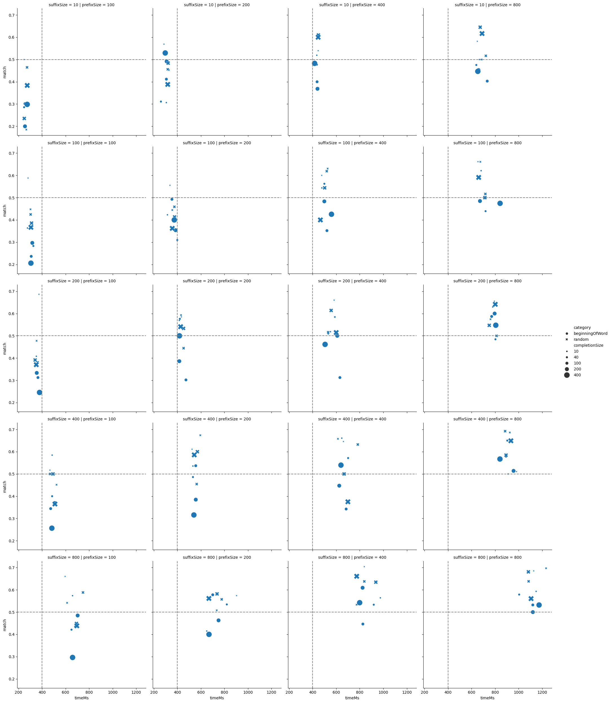
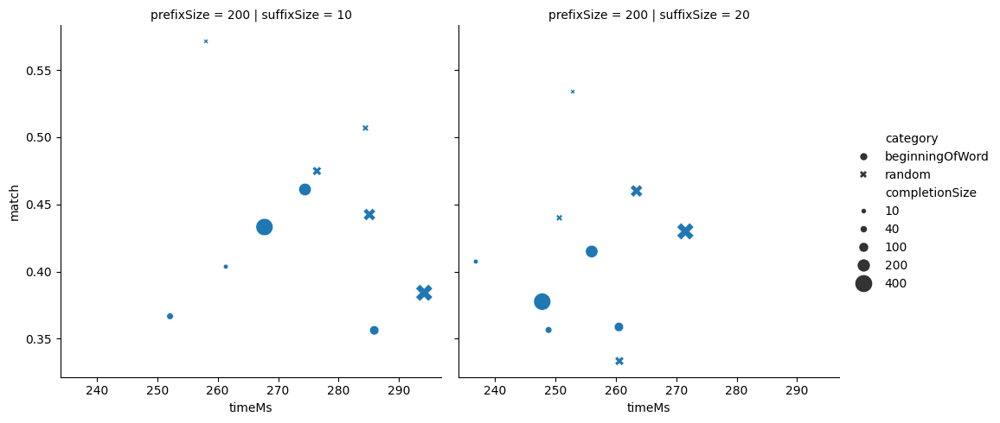

# The Open Auto Complete Blog

I'm not happy with the current state of inline AI coding assistants. That is, I'm talking about getting inline completions while I type. To me, they are slow and propose long snippets which are often incorrect. I'd much prefer quick, short completion of the next word or few characters.

For this reason, I started this project: An open source inline AutoComplete tool, focused on quick and short completions.

In addition, I'm planning to document the project in this blog to pave the way for others.

# A Simple Autocomplete Extension

Of course I started by implementing a VS Code Autocomplete Extension. I followed [Your First Extension](https://code.visualstudio.com/api/get-started/your-first-extension).

I wondered about how I should organize my code and considered various javascript dependency injection frameworks. In the end, I don't expect the project to become very complex. So I created the `CompletionManager`, implementing `InlineCompletionItemProvider`:

```ts
export class CompletionManager implements vscode.InlineCompletionItemProvider {
    async provideInlineCompletionItems(
    document: vscode.TextDocument,
    position: vscode.Position,
    context: vscode.InlineCompletionContext,
    vsCodeToken: vscode.CancellationToken
  ): Promise<vscode.InlineCompletionItem[]> {
    ...
  }
}
```

I instantiated and registered it in `extension.ts`:

```ts
context.subscriptions.push(
    vscode.languages.registerInlineCompletionItemProvider(
        { pattern: "**" },
        <manager>
    )
);
```

The `provideInlineCompletionItems()`-method is called whenever VS code determines that an inline-completion should be provided, that is basically after every keystroke.

# Completion Stop

This is a lot about feelings. I like the completion to continue until the beginning of the next word. Thus when I complete for example a variable name, I get the special characters after it, which the LLM typically predict pretty well. Then I see the next completion and can decide if I like it or not.

# Measuring Completion Performance

There are a lot of choices in creating the prompts for the auto completion. Most notable areas:

- Length of prefix and suffix to include
- Providing additional context

A lot about it is gut feeling and intuition. None the less, I'd like to measure as much as possible. Let's start with the basic options: choose a cutting point, a prefix, suffix and completion length and see if the string until the first word generated matches what we cut out.

I see two possible cutting points: random and beginning of word. Random has the nice feature of being unbiased. Beginning of word is closer to the use case of auto completion. I did measurements on a private C# code base, testing a range of parameters.



Looking at the graph, a prefix size of 200 with a short prefix seems a good compromise of speed and accuracy. The big graph was created with only about 50 samples per point. To make sure there are no statistical surprises, I generated more samples for prefix size 200 and suffix size 10 and 20:



# Fine Tuning and Serving Custom Models

I've spent the last few days looking into fine tuning and serving a custom LLM model efficiently. Playing with Huggingface Transformers and PyTorch I found an overhead of almost a second using [Qwen/Qwen2.5-0.5B](https://huggingface.co/Qwen/Qwen2.5-0.5B). Ollama seems to be a little better, in the neighborhood of 0.5s (with a NVIDIA GPU) but [vLLM](https://github.com/vllm-project/vllm) is even faster, clocking in at around 300ms, which is a huge difference for our low latency requirements.

I'm using [OpenVINO](https://www.intel.com/content/www/us/en/developer/tools/openvino-toolkit/overview.html)/CPU. This gave me the best results for short request, coming out ahead of using my integrated [Intel Arc A370M](https://www.intel.com/content/www/us/en/products/sku/228342/intel-arc-a370m-graphics/specifications.html) or CPU integrated [i7-13700H Irix Xe GPU](https://www.intel.com/content/www/us/en/products/sku/232128/intel-core-i713700h-processor-24m-cache-up-to-5-00-ghz/specifications.html)

I'll save you the story of all the things I've tried out and just highlight how it works. You'll find the detailed code in `qwen-fine-tune.jpynb`. Here the outline of the steps:

- Fix the tokenizer in Qwen: The some special tokens are not marked as special, causing `split_special_tokens` to be ignored
-
